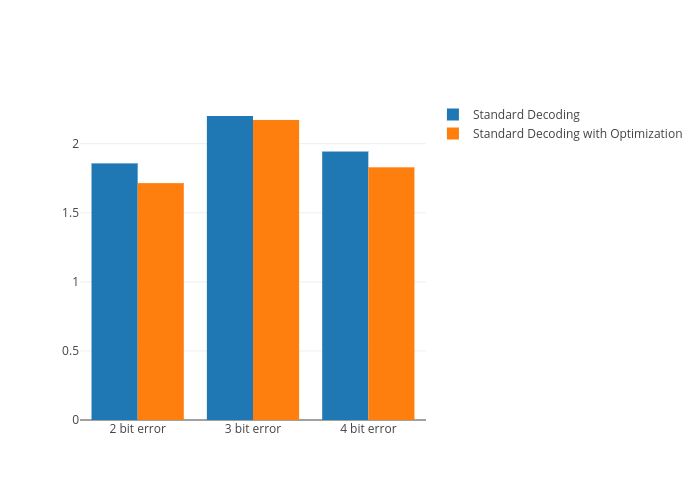

# Indroduction to Hamming codes as error reducing codes

```
What it will consist of :- 
```

* Theoretical Aspects
* Formulas
* Figures
* Other required stuffs

## Theoretical Aspects

* Hamming codes are the first of it's kind for error correcting codes which can correct error in a block of binary strings. 
* But there is a limit on correcting capability of a code word given by the formula floor((d-1)/2) where d is the minimum pairwise hamming distance between the words of the code.
*  When this limit is exceeded, undefined behavior occurs when attempting to apply error correction to the erroneous vector. This motivates the exploration and construction of new models that attempt to reduce the number of errors in the
received vector upon decoding
* In this we will try to analyze error reducing capabilities of the hamming codes. 
* We are going to focus on binary linear codes. 
* Messages are coded into some strings called as codeword.They have some limit upon the number of errors to be corrected.
* The [7; 4; 3]-Hamming code is the first Hamming code, where m = 3.

## Formulas

* Number of maximum error corrected - floor((d-1)/2)
* One bit of error can be corrected for length - (2^m -m -1)
* Codeword produced for one length correction - (2^m - 1)
* Hamming distance between the two words x; y^2 Fn2, d(x; y)

## Figure




## Word Done till Now

*  Suppose one or more errors are introduced into a codeword for a Hamming code of any order with standard decoding. Let q be the column of the parity-check matrix that is
determined to be erroneous (i.e., q is the product of the parity check matrix and the erroneous codeword). q is independent
of the initial message to be sen
*  The number of errors in the decoded message (standard decoding) is independent of the transmitted message
*  We have proved that the lower bound of hamming code error detection can be achieved by other error reducing methods
*  we  Consider a [n = 2m −1, 2m −1−m, 3]-Hamming code with standard decoding. If the received vector y has two errors present, then the index of the column labeled aserroneous by multiplying the parity check matrix with y will
always correspond to a 0 on the error vector.

## Concept behind Error reducing Capabilities of Hamming Codes

* Let G be the generator matrix and H be a PArity check Matrix for the Hamming Code [7,4,3].
* G=
      *1 1 1 0 0 0 0 
      *1 0 0 1 1 0 0 
      *0 1 0 1 0 1 0
      *0 0 1 1 0 0 1
*  H=
      *0 0 0 1 1 1 1
      *0 1 1 0 0 1 1
      *1 0 1 0 1 0 1
* In the standard Decoding of the Hamming code,let x be a dataword.The Codeword can be generated by G^T * x=y; y is the generated Codeword,G^T is the transpose matrix of the 
     Generator Matrix.
* Now let e be the error vector introduced in the channel.We will add e in the codeword y,so the received erreneous codeword would be y+e.
* Now the position at which error has occured can be known by multiplying the received codeword with the Parity Matrix .i.e H *  (y+e)  will give the column 
  of the H matrix,by knowing the column number we can flip that particular bit of our erreneous codeword anf can find the required dataword which is mapped to that 
   particular codeword.
* Then we will compare the original dataword and the received dataword i.e find hamming distance between the two.
* We will do this for all the possible datawords of length 4 and all the error vectors that can be generated .
* For example:-
  If we want to introduce 2 errors then there is 7!/5!*2! combinations of error vectors and 16 combinations of datawords,therefore the total number of valid codewords are
  336.
  On running this standard Decoding  Algorithm the average number of errors found is 1.8571.


* Lemma 1:-let q be the column number of the Parity Matrix in which error has occured in the Standard Decoding, then it is independent of the transmitted message ,it 
just depends upon the error introduced.
* Lemma 2:-The number of error in the decoded message in the standard decoding is indepedent of the transmitted message.

* lower bound for [7,4,3] Hamming code for standard decoding:-
  If we change our generator Matrix to 
*  G=
     * 1 1 1 0 0 0 0
     * 0 1 1 1 1 0 0
     * 0 1 0 1 0 1 0
     * 0 0 1 1 0 0 1
*  Then the average number of errors introduced decreases to 1.7143.While this improvement is relatively small, this Hamming code reaches the maximum level of error reduction that is theoretically possible for the
[7, 4, 3]-Hamming code with standard decoding. This means that for any [7, 4, 3]-Hamming code with two errors, the error reducing capabilities of standard decoding is limited to an
average of 1.7143 errors across all possible error vectors.


  

