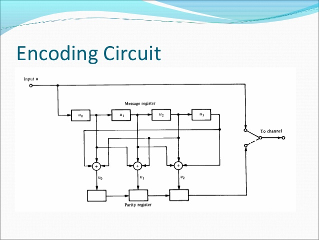
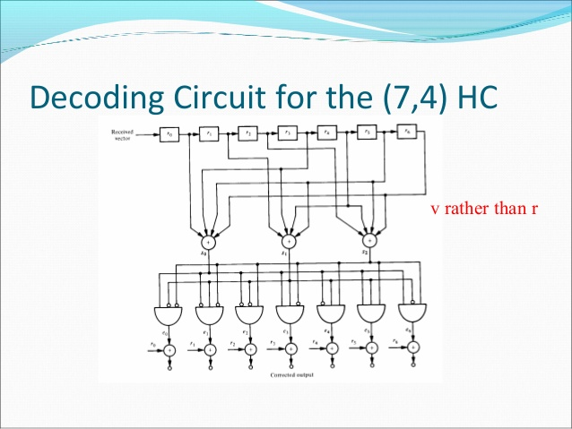

# Indroduction to Hamming codes as error reducing codes

```
What it will consist of :- 
```

* Theoretical Aspects
* Formulas
* Figures
* Other required stuffs

## Theoretical Aspects

* Hamming codes are the first of it's kind for error correcting codes which can correct error in a block of binary strings. 
* In this we will try to analyze error reducing capabilities of the hamming codes. 
* We are going to focus on binary linear codes. 
* Messages are coded into some strings called as codeword.They have some limit upon the number of errors to be corrected.
* The [7; 4; 3]-Hamming code is the first Hamming code, where m = 3.

## Formulas

* Number of maximum error corrected - floor((d-1)/2)
* One bit of error can be corrected for length - (2^m -m -1)
* Codeword produced for one length correction - (2^m - 1)
* Hamming distance between the two words x; y^2 Fn2, d(x; y)

## Figure






## Word Done till Now

*  Suppose one or more errors are introduced into a codeword for a Hamming code of any order with standard decoding. Let q be the column of the parity-check matrix that is
determined to be erroneous (i.e., q is the product of the parity check matrix and the erroneous codeword). q is independent
of the initial message to be sen
*  The number of errors in the decoded message (standard decoding) is independent of the transmitted message

