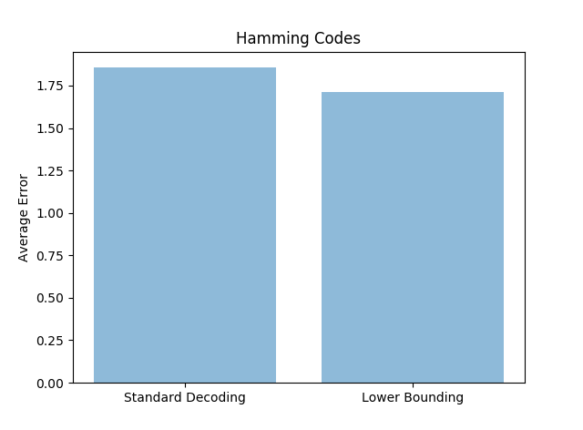
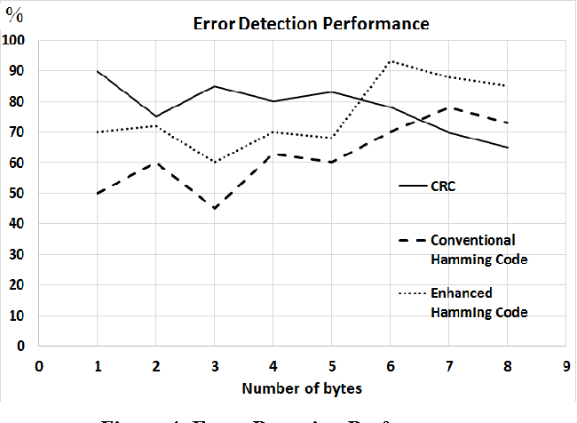

#  Hamming Codes as Error Reducing Codes
```

```
## About
* Hamming codes are the first of it's kind for error correcting codes which can correct error in a block of binary strings. 
* In this we try to analyze error reducing capabilities of the hamming codes. 
* We are focused on binary linear codes. 
 Messages are coded into some strings called as codeword.They have some limit upon the number of errors to be corrected.
* The [7; 4; 3]-Hamming code is the first Hamming code, where m = 3.
* Number of maximum error corrected - floor((d-1)/2)
* One bit of error can be corrected for length - (2^m -m -1)
* Codeword produced for one length correction - (2^m - 1)
* Hamming distance between the two words x; y^2 Fn2, d(x; y)
 
##Standard decoding of hamming code

* The [7,4,3]-Hamming code has generator matrix G and parity check matrix H, given below respectively:.
 * G = 
      * 1 1 1 0 0 0 0 
      * 1 0 0 1 1 0 0 
      * 0 1 0 1 0 1 0
      * 0 0 1 1 0 0 1
 * H = 
      * 0 0 0 1 1 1 1
      * 0 1 1 0 0 1 1 
      * 1 0 1 0 1 0 1

## Figure





## Explaination

* When generator matrix G is used along with the parity check matrix, the average number of errors found in the decoded message for all error vectors becomes 12/7 or about 1.7143. While this improvement is relatively small, this Hamming code reaches the maximum level of error reduction that is theoretically possible for the
[7,4,3]-Hamming code with standard decoding. 
* This means that for any [7,4,3]-Hamming code with two errors, the error reducing capabilities of standard decoding is limited to an average of 1.7143 errors across all possible error vectors. 


## Word Done till Now

*  Suppose one or more errors are introduced into a codeword for a Hamming code of any order with standard decoding. Let q be the column of the parity-check matrix that is
determined to be erroneous (i.e., q is the product of the parity check matrix and the erroneous codeword). q is independent
of the initial message to be sen
*  The number of errors in the decoded message (standard decoding) is independent of the transmitted message


